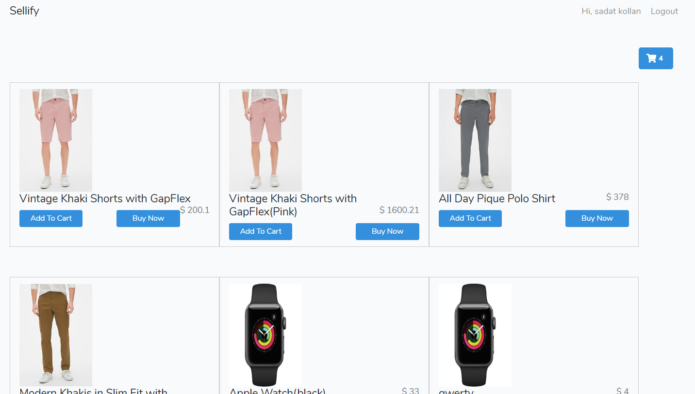
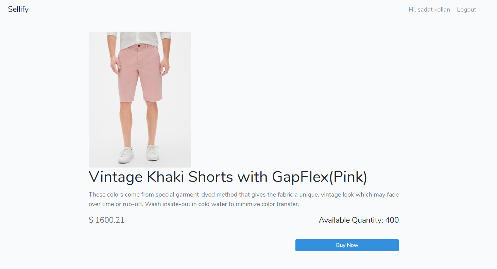

# Vue.js and laravel Ecommerce App

This Web App allows registered users to upload files.

<h2 id="screenshots">Screenshots Below</h2>

```````````````````````````````````````````````````
<h2 id="screenshots">Home</h2>


<h2 id="screenshots">Cart Modal</h2>


<h2 id="screenshots">Checkout</h2>

``````````````````````````````````````````````````````

<h2 id="development">Development</h2>


Run
```
$ create database and add settings to .env and then run "php artisan migrate"
```