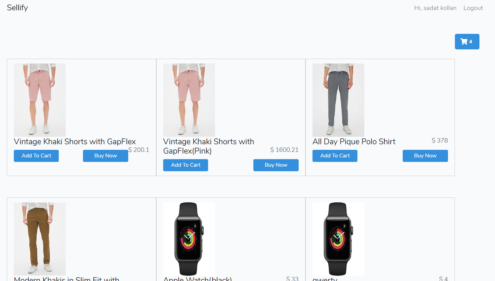
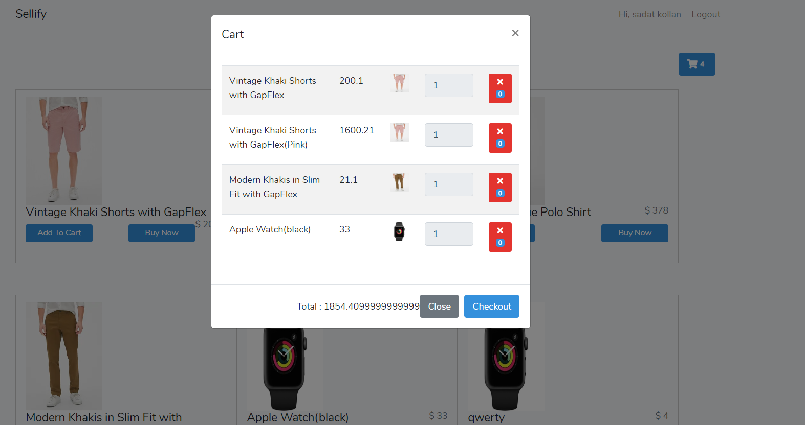
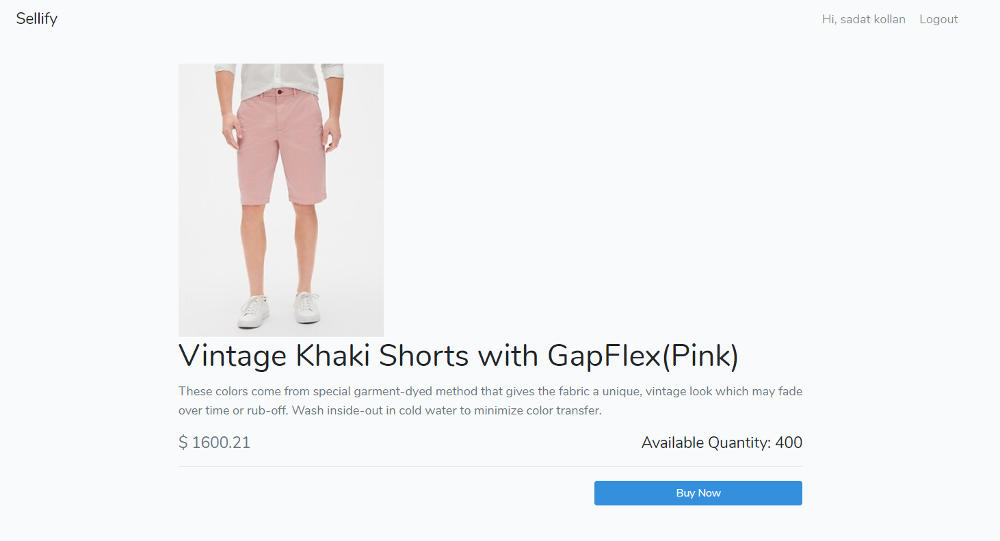

# Vue.js and laravel Ecommerce App

<h2 id="screenshots">Screenshot</h2>






<h2 id="development">Development</h2>


Run
```
$ create database and add settings to .env and then run "php artisan migrate"
```
